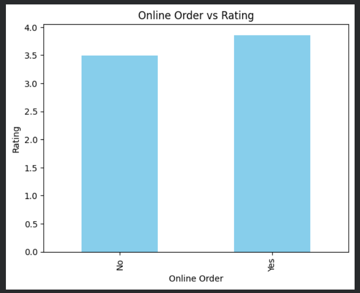
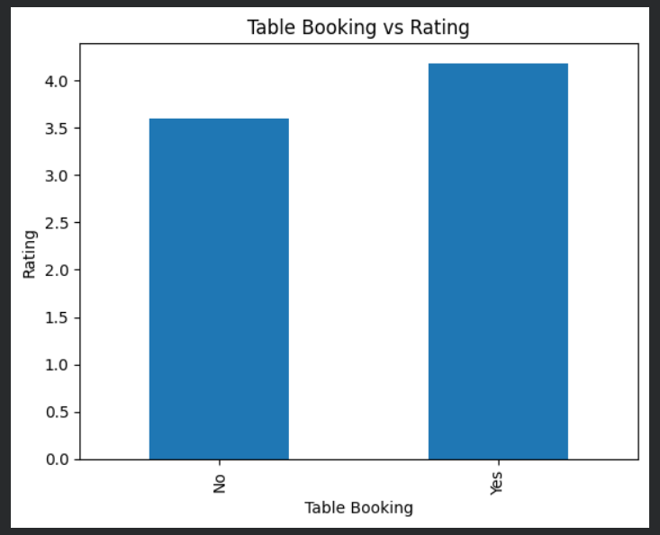
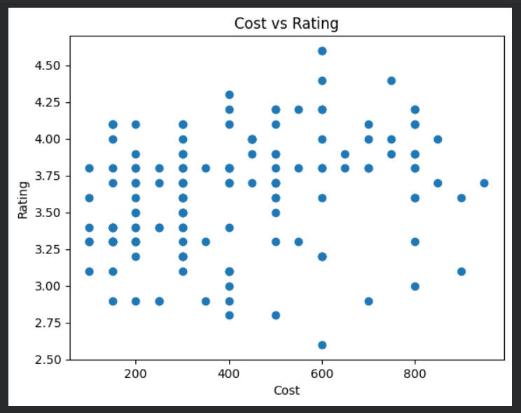
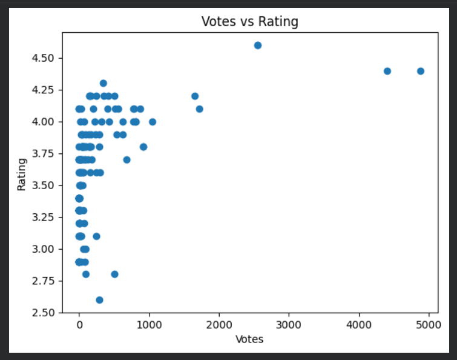
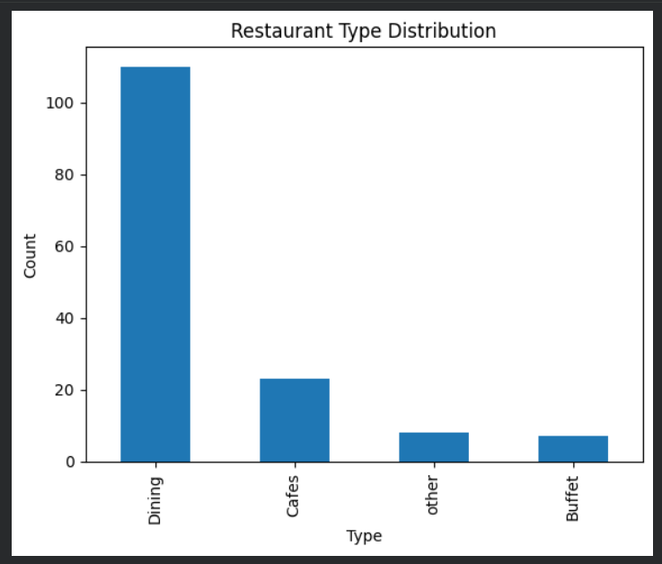

# 🍽️ Zomato Data Analysis Project

## 📌 Objective
The goal of this project is to analyze restaurant data and uncover patterns in ratings, cost, and customer engagement.

---

## 📂 Dataset
The dataset contains information about restaurants including:
- Name of restaurant  
- Online ordering availability  
- Table booking facility  
- Ratings  
- Number of votes  
- Approximate cost for two people  
- Restaurant type  

---

## 🧹 Data Cleaning
Performed the following steps to clean the dataset:
- Removed missing (null) values  
- Converted ratings from text (e.g., "4.1/5") to numeric format  
- Cleaned cost column by removing commas and converting to numbers  
- Removed duplicate records  

---

## 📊 Exploratory Data Analysis (EDA)

The following analysis was performed:

### 1. Online Order vs Rating
Analyzed whether restaurants offering online ordering have better ratings.

### 2. Table Booking vs Rating
Compared ratings of restaurants with and without table booking.

### 3. Cost vs Rating
Studied relationship between restaurant pricing and ratings.

### 4. Votes vs Rating
Checked if more popular restaurants (higher votes) have better ratings.

### 5. Restaurant Type Distribution
Analyzed the distribution of different types of restaurants.

---

## 📸 Visualizations

---

## 🔍 Key Insights
- Restaurants offering online ordering tend to have better ratings  
- Table booking restaurants are generally premium and highly rated  
- Higher cost does not guarantee better ratings  
- Restaurants with more votes are usually more popular and better rated  
- Most restaurants fall under a few dominant categories  

---

## 🛠️ Tools & Technologies
- Python  
- Pandas  
- Matplotlib  
- Google Colab  

---

## 📁 Project Structure
Zomato-Data-Analysis/ 
│ 
├── data/ 
│    └── clean_zomato.csv 
├── notebook/ 
│   └── zomato_analysis.ipynb 
├── images/ 
│   ├── online_vs_rating.png 
│   ├── table_booking.png 
│   ├── cost_vs_rating.png 
│   ├── votes_vs_rating.png 
│   └── restaurant_type.png 
├── README.md

---

## 🚀 Conclusion
This project demonstrates how raw data can be cleaned, analyzed, and transformed into meaningful insights using data analysis techniques.

## Author
Jhanvi Narayan
